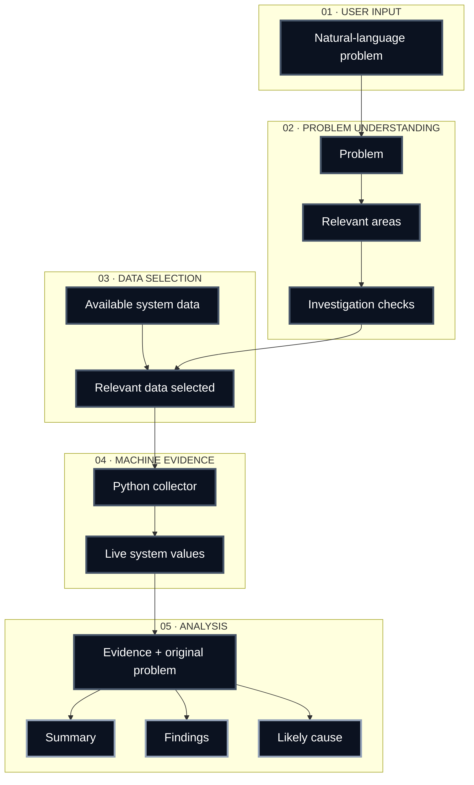

<div align="center">


<br>

*Don't guess what is wrong. Investigate the machine.*

</div>

<br><br>

## Start With the Symptom

A slow laptop. A loud fan. A battery that drains too fast.

Built in **Python with Gemini and `psutil`**, Faultprint turns everyday computer problems into a structured investigation — understanding the complaint, collecting relevant machine data, and analyzing the evidence in context.

> **The symptom starts the investigation. The machine provides the evidence.**

<br>

## Features

* Describe a normal computer problem in your own words.
* Turn the description into relevant investigation areas and checks.
* Select only the system data that can help with that problem.
* Collect actual CPU, memory, disk, processes, battery, network, uptime, partition, and temperature information.
* Analyze the collected evidence in the context of the original problem.
* Clearly distinguish between normal, problematic, and inconclusive findings.
* Give a useful message when the required system evidence is unavailable.
* Keep the diagnosis evidence based instead of relying on fixed thresholds.

<br>


## Investigation Flow

Consider a simple problem:

`"My laptop feels slow."`

Faultprint does not immediately assume that the CPU is the problem.

It first interprets the complaint and identifies what could be relevant. It may decide that processor activity, memory usage, running processes, storage, or other system information should be investigated.

It then selects the data that can actually help. Python collects that information from the machine. Finally, the collected values are analyzed together with the original complaint.

That distinction matters. A value is not automatically a problem just because it is high or low. Its meaning depends on the situation being investigated.


### The investigation pipeline



*From natural language, to a reasoned interpretation, to real machine evidence, to a grounded finding.*

<br>

## Run

**1. Clone the repository**
```bash
git clone https://github.com/beenish-majeed/faultprint.git
```

**2. Move into the project folder**
```bash
cd faultprint
```

**3. Install dependencies**
```bash
pip install -r requirements.txt
```

**4. Add your Gemini API key**

Create a `.env` file in the project root and add:
```env
API_KEY = your_key_here
```

**5. Start the program**
```bash
python main.py
```
<br>


## Future Direction

* Add support for more system sensors, such as GPU temperature and detailed disk health metrics.
* Build a lightweight desktop or web interface instead of a terminal-only workflow.
* Allow Faultprint to track a problem over time instead of a single point-in-time snapshot.
* Support additional operating systems beyond the current setup.
* Let users plug in their own preferred AI model instead of being limited to Gemini.
* Generate a shareable diagnostic report for troubleshooting with others.

<div align="center">

<br><br>

*Investigate the machine, and let the evidence speak for itself.*

</div>